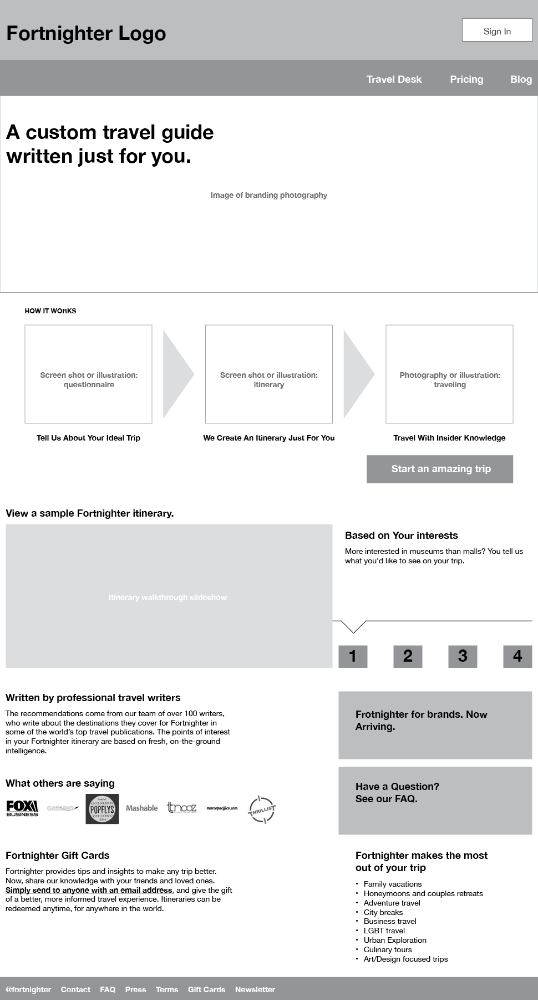
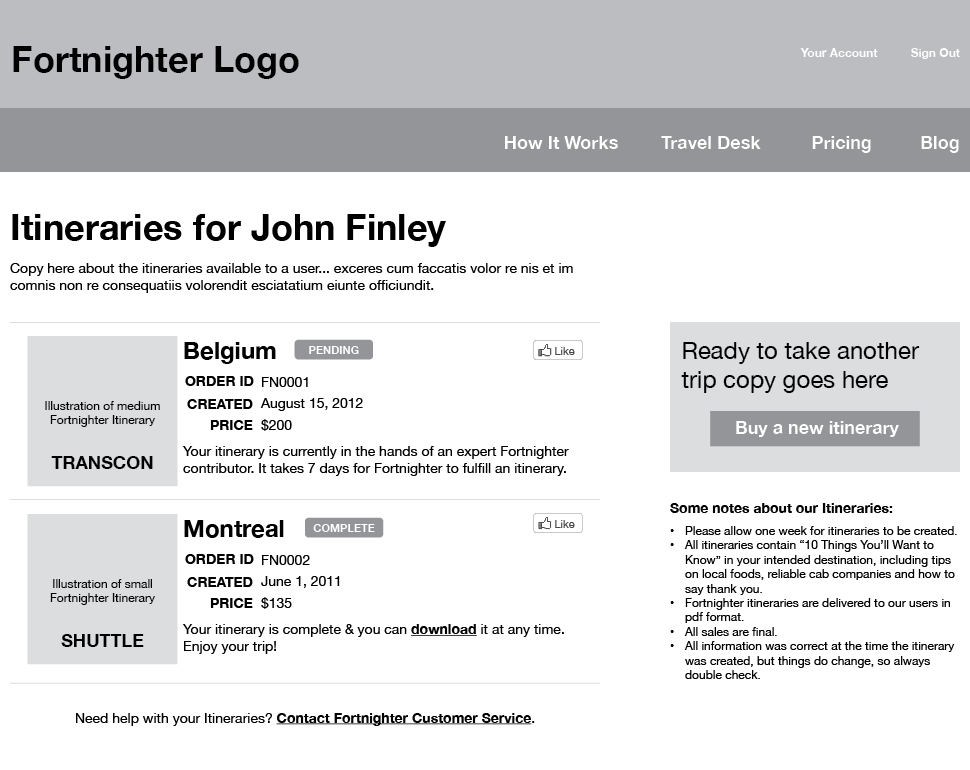
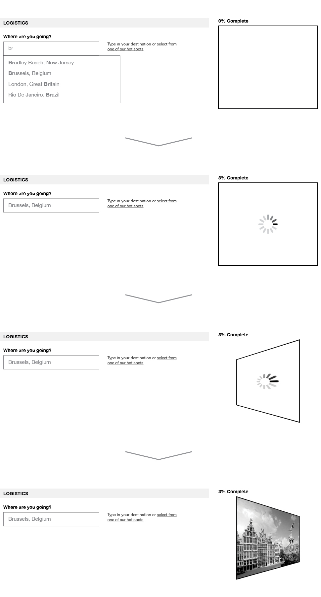
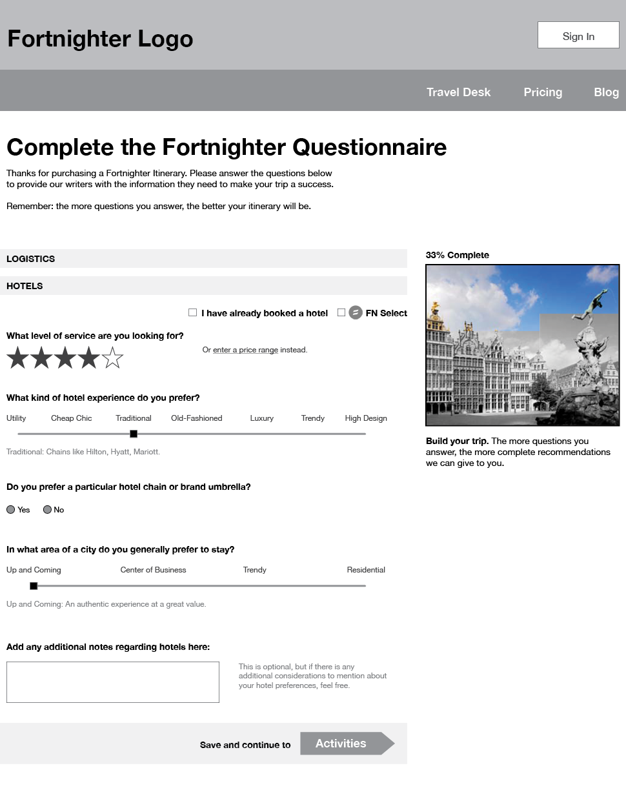
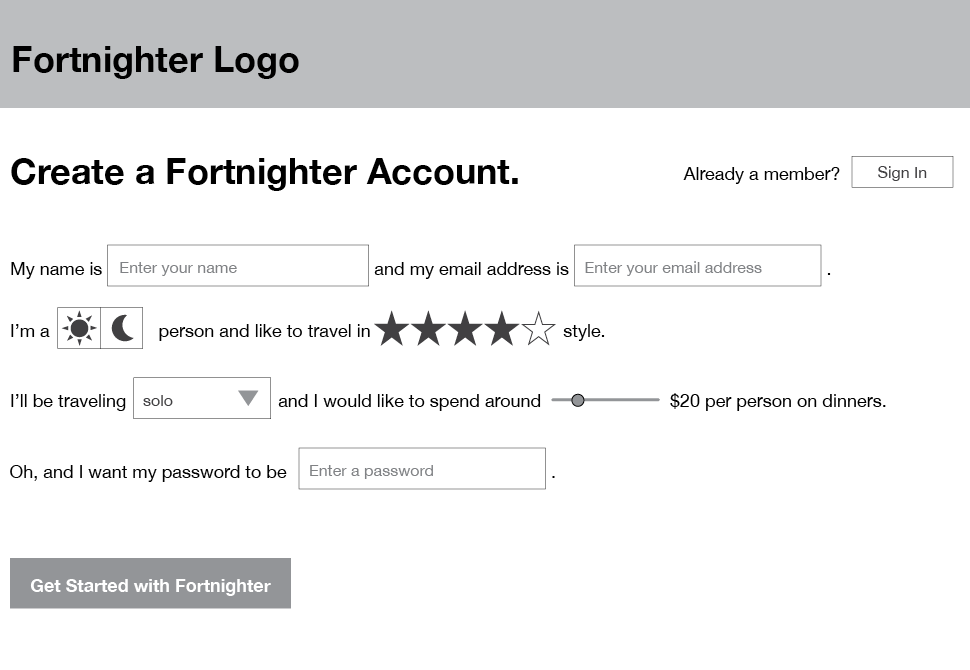

[Fortnighter.com](http://fortnighter.com/) provides custom travel itineraries written by professionals. The site's founders asked me to kick off a site redesign aimed at streamlining the user experience and increasing purchases.

The current site suffers from a lack of clarity – new users have a hard time figuring out what it was all about. Furthermore, the site didn't feel as cool or as fun as it could be. This service is all about traveling; it should feel exciting.

After going through the signup and itinerary creation process myself, I had a pretty good idea of where the experience fell short. Based on this list I began to wireframe an improved site structure, including the home page and itinerary questionnaire. I also provided Fortnighter with customer management techniques they could use to boost repeat visits and sales.

## Home Page

The home page's design was focused on education and conversion. Fortnighter wanted to get people signed up and buying, and that meant succinctly explaining what was going on. I enhanced the main call to action with a brief 1-2-3 of how Fortnighter works. Below that is a sort of carousel that goes a bit more in depth on the itinerary itself: how it's made, how you use it, and so forth.

The itinerary list is easy to manage. Each includes handy metadata, social sharing buttons, and of course its status (since itineraries are personalized, they can take up to a week to complete).

## The Itinerary Questionnaire

At the heart of the Fortnighter experience is the questionnaire. People will likely spend more time here than any other part of the site. It's here that they provide the details of their trip and what they'd like to see when they go.

The questionnaire is nothing more than a straight form with all of the questions inside. The whole experience could be improved by simplifying it — and by injecting a little bit of fun.

For starters, I replaced the questionnaire's progress indicator with a photographic "avatar" of their travel destination. It springs into action as soon as you tell Fortnighter where you are going (see below).

This avatar follows you through the questionnaire, tracking your progress. For every question you answer, a bit of the travel avatar is filled in. By the end of the questionnaire the picture is complete (and hopefully the questionnaire didn't feel quite so tedious).

Since the questionnaire is a lengthy affair, I stipulated that users have the ability to save questionnaires and come back to them later. Data collection such as this can pave the way for interesting analytics features, and Fortnighter can use customer's answers as suggested defaults for future questionnaires.

## Other Ideas

I also consulted on ways to improve the Fortnighter experience –  from the site and beyond. Here are three:

### 1. Blur the account process and the questionnaire process

Right now, an account is required to get anywhere in the itinerary process. Putting some of the more fun parts of the questionnaire up front—and allowing users to create an account with only an email address—might be a way to increase signups.

The goal is to get people to see the activity as an easy way to make the site more personal, not as creating yet another web account. Even if they don’t buy right away, if Fortnighter can convince them to create an account, there is an opportunity to message them in the future.

### 2. Fill in the dead week

Find ways to keep people excited between the time they complete the questionnaire and the time they get their itinerary. Tweet at them. Send them emails (“We haven’t forgotten about you”, “Your itinerary is assembling”). Show them shareable sneak peeks of museums or restaurants they will find once they open their itinerary.

### 3. Keep it up after the trip is over

Create a feedback loop by providing ways for the itinerary to live on after the trip is complete. This could take the form of shareable itinerary excerpts, or asking people to rate their trip (make them feel like experts now that they have expert advice), or even let the itinerary become a template for starting their trip scrapbook.
