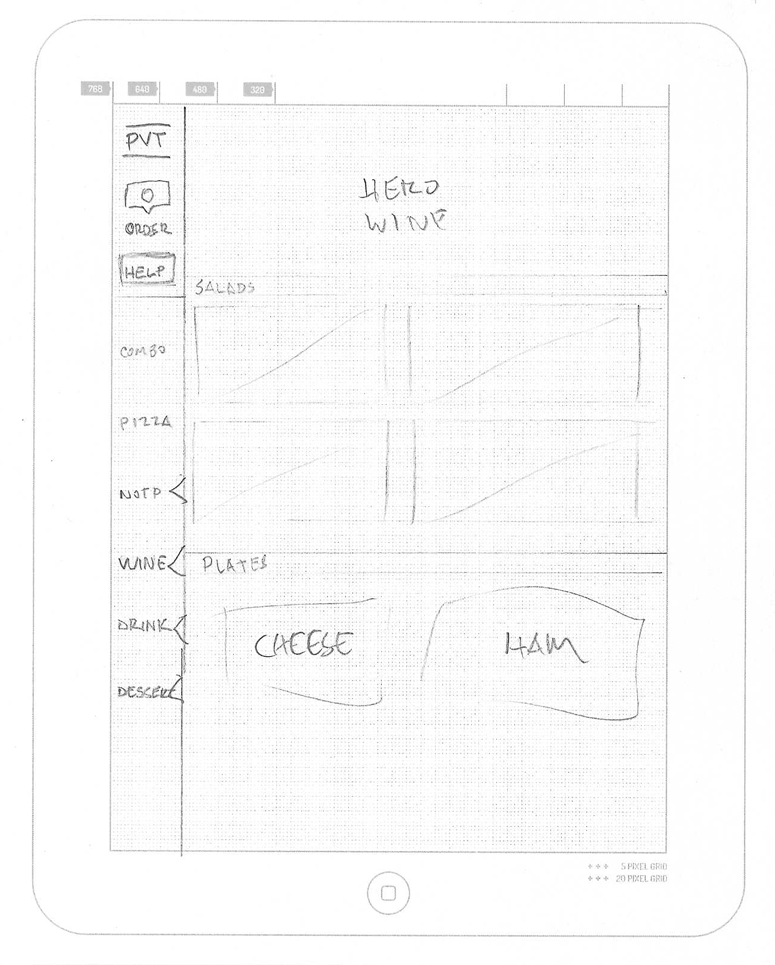
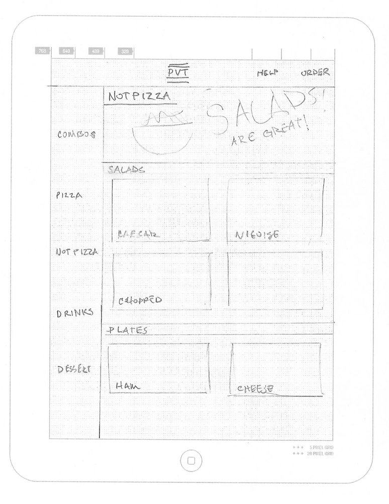
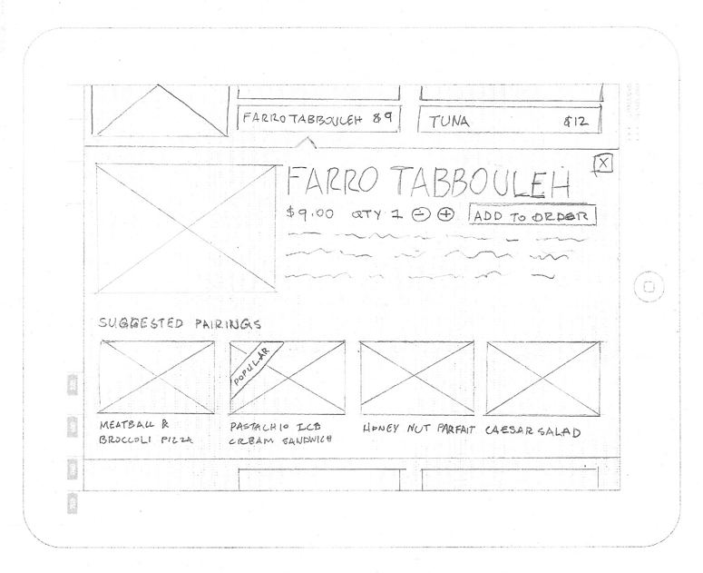
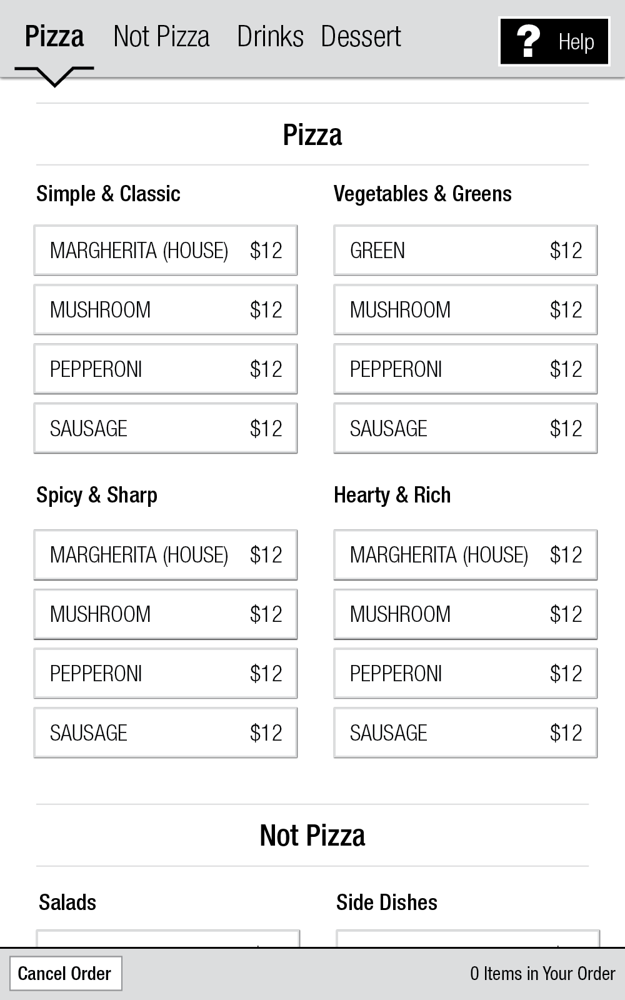
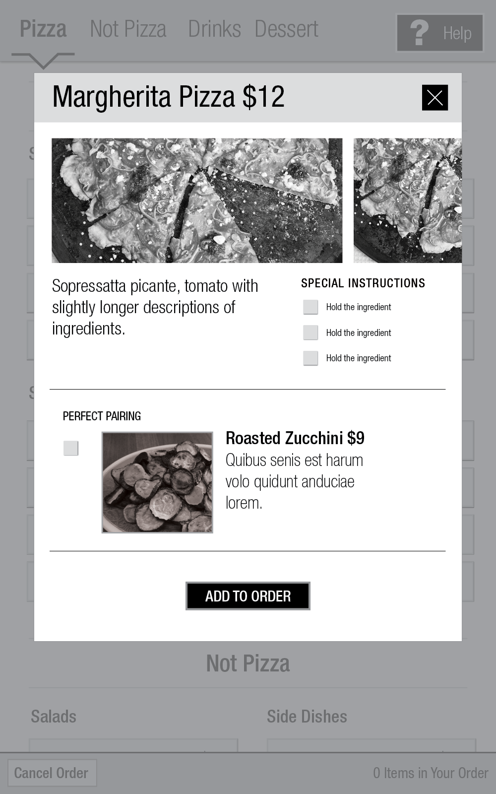
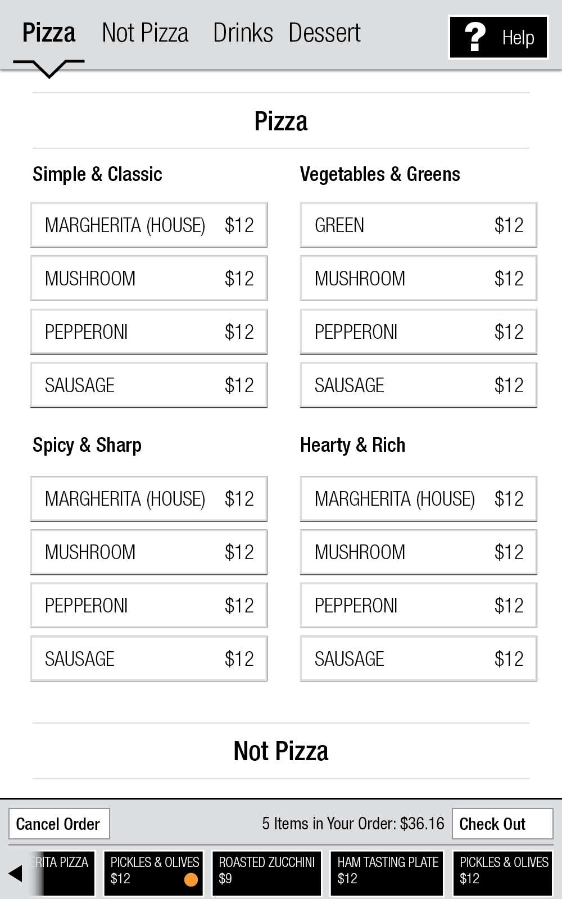
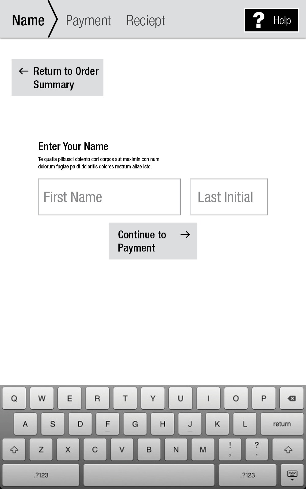
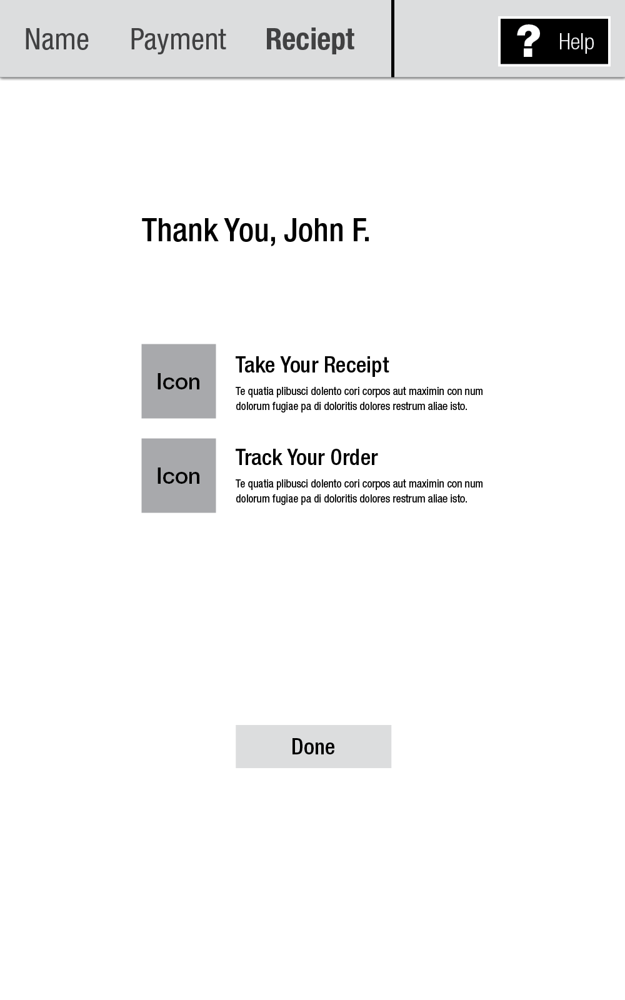
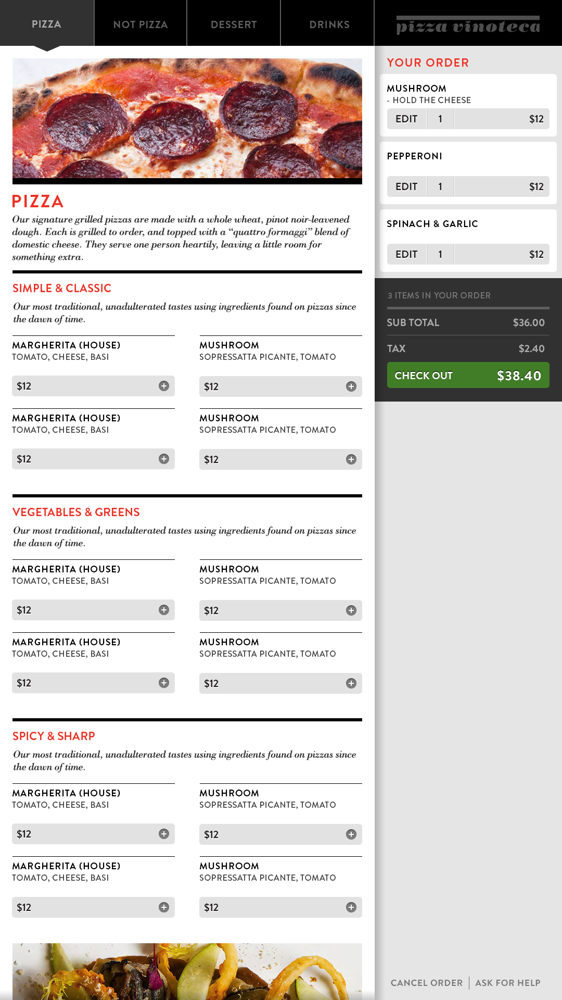

*Top Chef* winner Stephen Aspirinio asked The Barbarian Group to bring to life his idea for a digital restaurant experience, **Pizza Vinoteca**. Diners at Pizza Vinoteca would sit down and order from an iPad menu, while those ordering takeout would use an interactive kiosk and watch their food progress through the kitchen on digital signage.

We were tasked with designing all the digital components guests would interact with. The iPad menu would need to be usable for both repeat customers and tourists coming in off the street. The Kiosk would have strict criteria for checkout speed and needed to interface with point of sale hardware and a digital sign.

## Digital menus are hard

Before we even began to think about what the menu app would look like, we needed to think about what it means to order a meal. It turns out that ordering food is a messy and complex process. It's not easily fitted into the regimented script that a piece of software needs – and that is where the user experience gets into trouble.

Consider the following scenarios:

- You place and order, then change your mind to something else.
- You order multiple items, but at different times during your meal.
- You order a menu item, but want it prepared a certain way.
- You order two of the same menu item, but substitute an ingredient on one of them.

All of these things happen at a restaurant and the humans taking your order do a great job in communicating these orders to the kitchen staff. So when you substitute the waitstaff for an iPad application or a digital kiosk all of these things and more need to be accounted for. In the end, this was responsible for most of the complexity in the app and kiosk.

Of course we didn't know what all of these potholes would be until we started making things. Which is why we needed a creative process that could account for change.

## Process

We had an iPad app, a touchscreen kiosk, and a digital sign to make. They had to do a variety of things, but they also had to provide a cohesive experience for first-time diners and repeat customers.

So we started sketching.

Our first task was to find a framework in which we could present the iPad menu. A typical paper menu is just a big list; but with a digital app, we could add value with an experience that educates the diner about what each item is or how it's made. It could give them the push they need to order an additional item (great news for the restaurant) or to discover a new dish they would not typically go for.

Our sketches allowed us to experiment and quickly evaluate our work. We took inspiration from fashion, form editorial, from e-commerce and social media and brought them to bear on our menu.

In some of these sketches, we were trying to find the right density of information. In others, we were concerned with the right way to navigate from section to section, or how to show items in the menu.

## Interactive Kiosk

When the iPad app was in a good place I was free to move onto the kiosk: a 22" touchscreen display for people ordering their food to go. And since the kiosk was simpler than the app, things moved more smoothly. It's also important to consider the context of use for both menus: the iPad app was a sit-down group experience but the kiosk was about the individual, was quicker, and included things like credit card payments.

Compared to the iPad app, the kiosk is more focused; the customers walk up, select from the menu, and pay. The menu is presented as a single scrollable list; touching the navigation elements at the top will scroll the list to the respective place.

Tapping a menu item will bring up a detail panel. Adding that menu item will cause it to show up in your "tab".

Tapping "checkout" will bring up the tab view and marks the start of the checkout funnel. From this view any item can be edited or changed in quantity.

From here on out the checkout process walks customers down the road to payment and eventually, their food. Handling credit cards with a touch screen display makes it easy to sign right on the screen. When everything is all done, a confirmation view is displayed as their receipt prints.

And after our visual designers took a crack at it:

## Order Tracking Display

The order tracking display gives takeout customers an idea of the time remaining until their food is ready. Their name given at the kiosk is added to a running list of other waiting customers on a bank of three large HD displays.



Using data provided by the kitchen's back of house ordering system we can approximate how long until their food is ready. The remainder of the display is used to show entertaining content, such as everyday objects translated into Italian.
